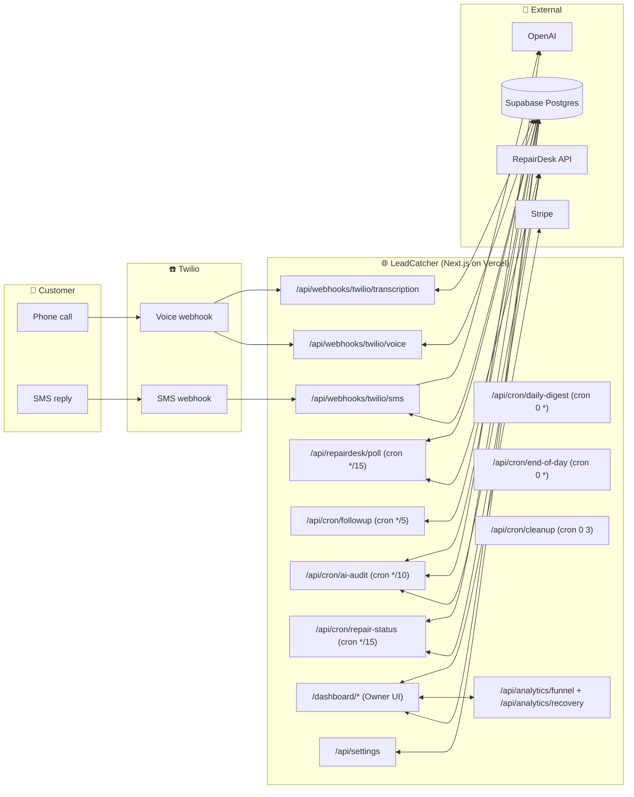
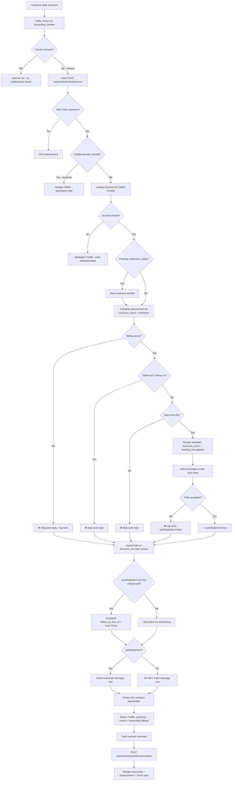
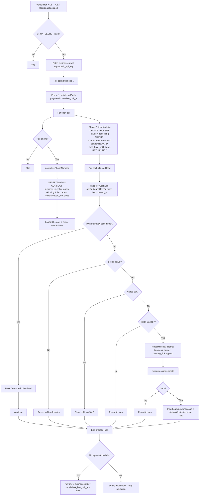
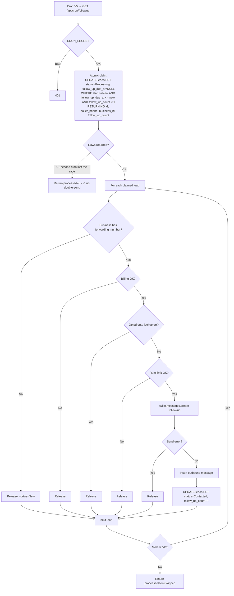
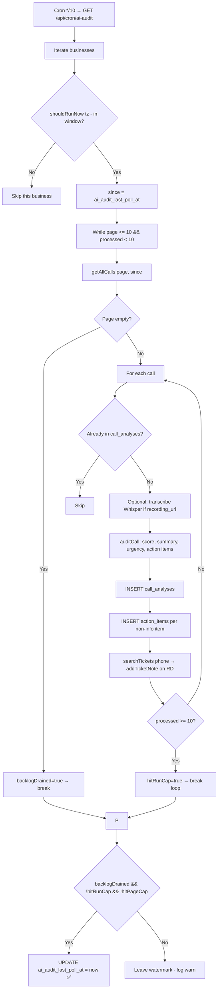
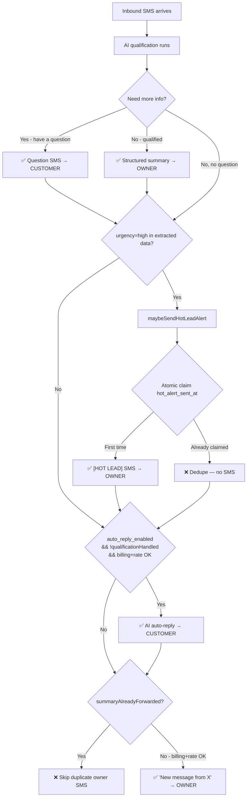

# LeadCatcher Workflow Chart

End-to-end map of every actor (end customer, business owner, system/cron) and
what happens when they do something. All flows reflect the current code on
`claude/fix-review-missed-calls-iGs1v` (post-fix).

Mermaid diagrams render natively on GitHub. Each section has a short prose
walkthrough so you can read it without rendering.

> Legend
> - **Customer** = the person who called or replied via SMS. Never logs in.
> - **Owner** = the shop owner / staff. Logs into the Next.js dashboard.
> - **System** = Vercel cron jobs + Twilio + RepairDesk + Supabase.
> - Boxes with `❌` = hard skip (no SMS sent), `✅` = SMS dispatched, `⏸` = deferred.

---

## 1. Top-level architecture

How the parts fit together. This is the only diagram that's not a flowchart.



---

## 2. Entry point A — Customer's phone call (live missed call via Twilio)

Phone rings → Twilio forwards → owner doesn't answer → Twilio fires the voice
webhook on LeadCatcher. The webhook does five things in order: idempotency
claim, business lookup, billing/opt-out/rate-limit checks, send auto-reply,
record voicemail. **Auto-reply only commits to DB if Twilio actually accepted
the send (Finding 4 fix).**



**Files**: `src/app/api/webhooks/twilio/voice/route.ts`,
`src/app/api/webhooks/twilio/transcription/route.ts`,
`src/lib/sms-template.ts`.

---

## 3. Entry point B — Customer replies via SMS

Customer texts back the business number. This is where AI qualification +
hot-lead alert + STOP keyword handling all live.

```mermaid
flowchart TD
    A[Customer sends SMS to business number] --> B[Twilio POST /api/webhooks/twilio/sms]
    B --> C{Valid signature?}
    C -->|No| C1[403]
    C -->|Yes| D{MessageSid claimed?}
    D -->|Yes| D1[Empty TwiML - dedupe]
    D -->|No| E[Lookup business]

    E --> F{Body == STOP/UNSUBSCRIBE/CANCEL/END/QUIT?}
    F -->|Yes| F1[Insert opt_outs row + send TCPA confirmation] --> END1[Return]
    F --> G{Body == START?}
    G -->|Yes| G1[Delete opt_outs row + confirmation] --> END2[Return]
    G --> H{Customer in opt_outs?}
    H -->|Yes| H1[Log + return - never reply]
    H -->|No| I[Check billing]

    I --> J[Upsert lead, fetch qualification fields]
    J --> K[Insert inbound message + cancel follow_up_due_at]
    K --> L[analyzeIntent → set leads.intent / ai_summary]

    L --> M{billing.allowed && status != qualified?}
    M -->|No| M1[Skip qualification]
    M -->|Yes| N{Rate limit OK?}
    N -->|No| N1[Skip qualification]
    N -->|Yes| O[qualifyLead OpenAI or heuristic]

    O --> P[UPDATE leads SET qualification_status, _data, _step]
    P --> Q{Qualified?}
    Q -->|No, has next_question| Q1[✅ Send question SMS to customer]
    Q -->|Yes| Q2[buildOwnerSummary → ✅ SMS to owner_phone]
    Q -->|No, no next_question| Q3[No-op]

    Q1 --> R
    Q2 --> R[Set qualification_summary_sent_at]
    Q3 --> R
    M1 --> R
    N1 --> R

    R --> S{urgency == high?}
    S -->|Yes| S1[maybeSendHotLeadAlert: atomic claim hot_alert_sent_at]
    S1 --> S2{Was first claim?}
    S2 -->|Yes - billing+rate ok| S3[✅ HOT LEAD owner SMS]
    S2 -->|No - already sent| S4[Dedupe - no SMS]
    S -->|No| T

    S3 --> T
    S4 --> T[Auto-reply branch]

    T --> U{auto_reply_enabled && !qualificationHandled?}
    U -->|Yes| U1[generateAutoReply → ✅ SMS]
    U -->|No| V

    U1 --> V{Owner notification needed?<br/>i.e. summary not already forwarded}
    V -->|Yes - billing+rate ok| V1[✅ "New message from..." SMS to owner]
    V -->|No| V2[Skip - duplicate of summary]

    V1 --> END3[Mark webhook processed]
    V2 --> END3
```

**Files**: `src/app/api/webhooks/twilio/sms/route.ts`,
`src/lib/lead-qualification.ts`, `src/lib/hot-lead-alert.ts`,
`src/lib/ai-auto-reply.ts`.

**Skip rules (per spec)** — qualification is *not* sent when:
- Billing inactive
- Customer opted out (we never reach this code; opt-out short-circuits earlier)
- Rate limit blocked
- `qualification_status === 'qualified'`

---

## 4. Entry point C — RepairDesk missed call (no live Twilio call)

Missed calls that never hit Twilio (e.g. shop's main line uses RepairDesk's
own phone). The poll cron pulls them and treats them like missed calls. The
3-minute grace window lets the owner call back before LeadCatcher fires the
auto-reply.



**Files**: `src/app/api/repairdesk/poll/route.ts`,
`src/lib/sms-template.ts`.

---

## 5. Follow-up cron (atomic claim, no double-send)

Runs every 5 minutes. The atomic claim is the entire point — two cron
invocations cannot both grab the same lead.



**Key invariant**: only the cron run that wins the UPDATE actually sends. The
loser sees an empty result set and exits without dispatching a single SMS.

**File**: `src/app/api/cron/followup/route.ts`.

---

## 6. AI audit cron (call-quality scoring)

Runs every 10 minutes during business hours (adaptive schedule throttles
overnight). Pulls calls from RepairDesk, transcribes, scores via OpenAI,
creates action items, syncs notes back to RepairDesk tickets. **Watermark only
advances when the backlog is fully drained (Finding 5 fix).**



**File**: `src/app/api/cron/ai-audit/route.ts`.

---

## 7. Repair-status cron + Google review request (Feature C)

Runs every 15 minutes. Polls RepairDesk tickets, sends customer-facing status
updates, and **fires a one-shot Google review request when a ticket transitions
to Completed/Paid/Picked Up** (deduped per ticket).

```mermaid
flowchart TD
    A[Cron */15 → GET /api/cron/repair-status] --> B[Businesses with status_updates_enabled]
    B --> C[For each: getTickets pages 1-3]
    C --> D[For each ticket with phone]

    D --> E{In ticket_status_tracking?}
    E -->|No| E1[Insert tracking row, no SMS] --> NEXT
    E -->|Yes| F{Status changed?}
    F -->|No| NEXT[next ticket]
    F -->|Yes| G[Update tracking last_status]

    G --> H{New status in REVIEW_TRIGGER set?<br/>Completed / Paid / Picked Up}
    H -->|Yes| H1[sendReviewRequest helper]
    H -->|No| I

    H1 --> H2{Already a review_requests row for this ticket?}
    H2 -->|Yes - dedupe hit| H3[❌ Skip] --> I
    H2 -->|No| H4{Billing OK?}
    H4 -->|No| H5[❌ Skip] --> I
    H4 -->|Yes| H6{Opted out?}
    H6 -->|Yes| H7[❌ Skip] --> I
    H6 -->|No| H8{Rate limit?}
    H8 -->|No| H9[❌ Skip] --> I
    H8 -->|Yes| H10[✅ Send "Thanks ... please review" SMS]
    H10 --> H11[INSERT review_requests with ticket_id]
    H11 --> I

    I{New status in STATUS_MESSAGES?<br/>In Progress / Ready / etc.}
    I -->|Yes - billing+rate+opt-out OK| I1[✅ Status SMS to customer]
    I -->|No| NEXT
    I1 --> NEXT
```

**Dedupe key**: unique partial index `idx_review_requests_business_ticket` on
`(business_id, ticket_id) WHERE ticket_id IS NOT NULL`.

**Files**: `src/app/api/cron/repair-status/route.ts`,
`src/lib/review-request.ts`, migration `007_recovery_workflow.sql`.

---

## 8. Owner dashboard — what the business owner can do

The owner is the only authenticated user. Auth is Supabase email/password.
RLS scopes every query to their business.

```mermaid
flowchart TD
    L[Owner visits /login] --> A{Authed?}
    A -->|No| A1[Sign in / sign up via Supabase Auth]
    A1 --> B{Has business row?}
    B -->|No| ONB[/onboarding - create business + set forwarding_number]
    B -->|Yes| H[/dashboard home]
    A -->|Yes| H

    H --> NAV{Pick a section}

    NAV --> CALLS[/dashboard/calls<br/>Twilio + RD calls, filters, audit details]
    NAV --> AUDIT[/dashboard/audit<br/>AI quality scores, breakdown]
    NAV --> COACH[/dashboard/coaching<br/>Coaching notes per employee]
    NAV --> ACTS[/dashboard/actions<br/>Action items inbox - call back / book / quote]
    NAV --> FUPS[/dashboard/followups<br/>Pending and sent follow-ups]
    NAV --> CUST[/dashboard/customer<br/>Customer timeline]
    NAV --> ANAL[/dashboard/analytics<br/>Funnel + Recovery score]
    NAV --> SETT[/dashboard/settings<br/>Business profile + integrations]
    NAV --> BILL[/dashboard/billing<br/>Stripe portal]

    SETT --> SETT1[business_phone, owner_phone, hours, timezone]
    SETT --> SETT2[sms_template open/closed]
    SETT --> SETT3["booking_url (Feature A)"]
    SETT --> SETT4["google_review_link (Feature C)"]
    SETT --> SETT5[repairdesk_api_key + store_url]
    SETT --> SETT6[auto_reply_enabled, daily_digest_enabled, status_updates_enabled]

    SETT1 --> POST[POST /api/settings → Zod validate → service-role update]
    SETT2 --> POST
    SETT3 --> POST
    SETT4 --> POST
    SETT5 --> POST
    SETT6 --> POST

    BILL --> BILL1[POST /api/stripe/checkout]
    BILL --> BILL2[POST /api/stripe/portal]
    BILL1 --> STRIPE[Stripe Checkout]
    BILL2 --> STRIPE
    STRIPE --> WEBHOOK[POST /api/webhooks/stripe → update stripe_status]

    ANAL --> AF[/api/analytics/funnel<br/>missed→contact→book + revenue + leaderboard]
    ANAL --> AR["/api/analytics/recovery (Feature E)<br/>recovery_rate + estimated_recovered_revenue"]
```

---

## 9. Notification fan-out (who hears about a new lead?)

Single inbound SMS from a customer can trigger multiple outbound messages.
This shows the order and the dedupe rules.



**Dedupe summary**:
- **Hot lead**: `leads.hot_alert_sent_at` (atomic UPDATE...WHERE IS NULL)
- **Qualification summary vs generic owner notify**: `lastSummary` flag in
  request scope — never both
- **Review request**: unique index on `(business_id, ticket_id)`
- **Status update SMS**: `ticket_status_tracking.last_status` change detection
- **Webhook idempotency**: `webhook_events.event_id` unique on Twilio
  CallSid/MessageSid

---

## 10. Data model touched per flow

Quick reference of which tables each entry point writes to:

| Flow | businesses | leads | messages | call_analyses | review_requests | opt_outs | webhook_events |
|------|:---:|:---:|:---:|:---:|:---:|:---:|:---:|
| Voice webhook (missed call) | R | UPSERT, UPDATE | INSERT (only on success) | INSERT placeholder | — | R | UPSERT |
| Transcription webhook | R | R | INSERT | UPDATE | — | R | UPSERT |
| SMS webhook (inbound) | R | UPSERT, UPDATE | INSERT | — | — | R/UPSERT/DELETE | UPSERT |
| RepairDesk poll | UPDATE watermark | UPSERT, UPDATE | INSERT | — | — | R | — |
| Follow-up cron | R | UPDATE atomic claim | INSERT | — | — | R | — |
| AI audit cron | UPDATE watermark | — | — | INSERT | — | — | — |
| Repair-status cron | R | — | — | — | INSERT | R | — |
| Settings POST | UPDATE | — | — | — | — | — | — |
| Stripe webhook | UPDATE billing | — | — | — | — | — | UPSERT |

R = read only.

---

## 11. Cron schedule (post-fix)

| Path | Schedule | Purpose |
|------|----------|---------|
| `/api/repairdesk/poll` | `*/15` | RepairDesk missed-call ingestion (Finding 1: was `*/3`, watchdog removed) |
| `/api/cron/followup` | `*/5` | Send 15-min follow-up SMS (Finding 3: now atomic) |
| `/api/cron/ai-audit` | `*/10` | Adaptive schedule, gated inside handler |
| `/api/cron/repair-status` | `*/15` | Status updates + review requests (Feature C) |
| `/api/cron/daily-digest` | `0 *` | Hourly check, runs once/day per business |
| `/api/cron/end-of-day` | `0 *` | Hourly check, EOD report at owner's local time |
| `/api/cron/cleanup` | `0 3` | Nightly cleanup |
| `/api/cron/call-review` | `0 */2` | Smart call review |

**Removed**: `/api/cron/missed-call-watchdog` (was duplicating
`/api/repairdesk/poll`; route still exists but no-ops).

---

## 12. Guard rails applied to every outbound SMS

Every code path that sends SMS goes through this stack in order:

1. **Billing** — `checkBillingStatus(businessId)`. Stripe `active` / `trialing`.
2. **Opt-out** — `opt_outs(business_id, phone_number)`. Fail closed on lookup
   error (TCPA).
3. **Rate limit** — `checkSmsRateLimit(businessId, phone)`:
   - 5 outbound / hour / caller
   - 200 outbound / hour / business
   - Counted via `messages` ⨝ `leads` inner join (Finding 6 fix)
   - Fail closed on query error
4. **Phone normalization** — E.164 via `normalizePhoneNumber`.
5. **Twilio send acceptance** — never persist message rows or schedule
   downstream actions before Twilio responds OK (Finding 4 fix).
6. **PII masking in logs** — `logger` redacts phone digits except last 4.

If any of 1–4 says no → no SMS, no DB write. If 5 fails → no DB write either.

---

## Where to start reading the code

- `src/app/api/webhooks/twilio/voice/route.ts` — primary missed-call entry
- `src/app/api/webhooks/twilio/sms/route.ts` — primary inbound-SMS entry
- `src/app/api/repairdesk/poll/route.ts` — secondary missed-call entry
- `src/lib/lead-qualification.ts` — Feature B brain
- `src/lib/review-request.ts` — Feature C brain
- `src/lib/hot-lead-alert.ts` — Feature D brain
- `src/lib/recovery-score.ts` + `src/app/api/analytics/recovery/route.ts` — Feature E
- `src/lib/sms-template.ts` — Feature A renderer
- `supabase/migrations/007_recovery_workflow.sql` — schema additions
